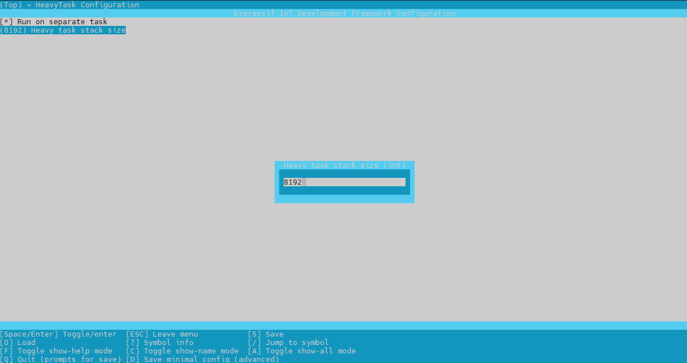

# HeavyTask

This is a simple helper library for FreeRTOS to offload long operations
to another task.

Operations are performed on a FIFO basis. They are managed through a queue and
the task is created/destroyed on demand, freeing up the stack when not needed.

It can be enabled/disabled as needed without changing the code.
It integrates with esp-idf as a component and add to the menuconfig:

<p align="center">
  
</p>

## Usage

```cpp
class FancyClass : public HeavyTask
{
public:
	const char * getName() const override
	{
		return "FancyClass";
	}
	
	void longTask() override
	{
		// Do something long here!
	}
};

void main()
{
	FancyClass fc;
	addLongTask(&fc);
	while(true) {
		// The task will created, run asyncronously, and destroyed.
	}
}
```
